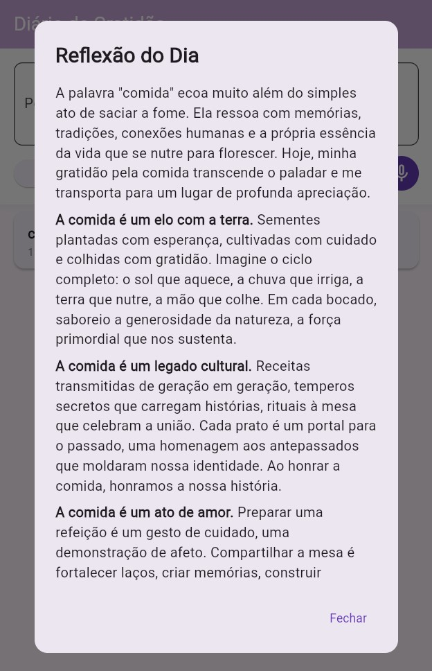
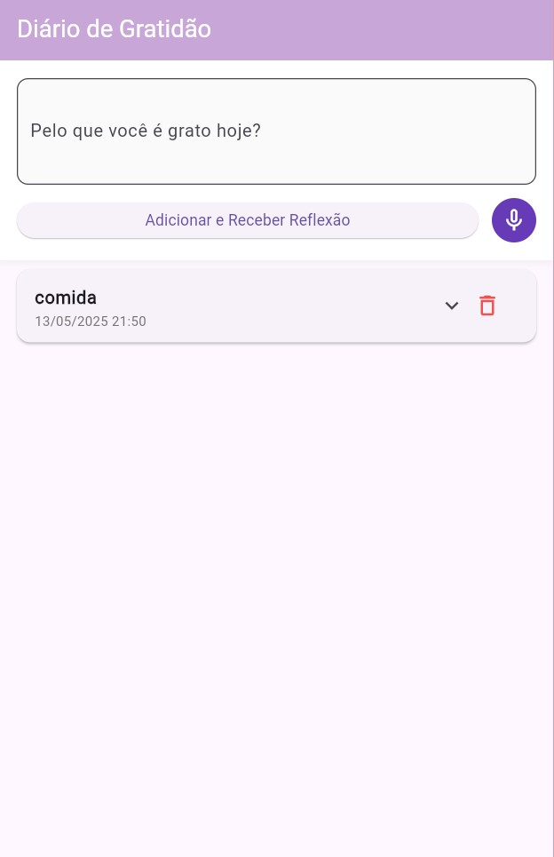

# 📔 Diário de Gratidão

Um aplicativo mobile desenvolvido em Flutter que permite aos usuários registrarem suas gratidões diárias e receberem reflexões inspiradoras geradas por IA.

## 📱 Descrição

O Diário de Gratidão é um aplicativo que incentiva a prática da gratidão diária, permitindo que os usuários:
- Registrem pelo que são gratos a cada dia
- Recebam reflexões personalizadas e inspiradoras baseadas em suas gratidões
- Utilizem reconhecimento de voz para adicionar entradas
- Visualizem o histórico completo de suas gratidões e reflexões
- Mantenham uma rotina positiva de auto-reflexão

## 🎨 Screenshots

### Tela Principal


*Tela principal mostrando a lista de gratidões*


### Adicionando Gratidão


*Campo de entrada para nova gratidão, por teclado ou reconhecimento de voz*


### Reflexão da IA


*Dialog mostrando a reflexão gerada pela IA*


### Histórico de gratidão


*Lista com histórico de reflexões anteriores*


*Reflexões da IA do item selecionado*


### Deletar item do histórico


*Deletar item selecionado*


## 🛠️ Tecnologias Utilizadas

- **Flutter** - Framework para desenvolvimento mobile multiplataforma
- **Google Gemini API** - API de IA generativa para criar reflexões personalizadas
- **shared_preferences** - Armazenamento local de dados
- **speech_to_text** - Reconhecimento de voz para input de texto
- **flutter_markdown** - Renderização de texto formatado
- **http** - Requisições HTTP para a API
- **intl** - Formatação de datas e horários

## 🚀 Instruções de Instalação e Execução

### Pré-requisitos

1. Flutter SDK instalado (versão 3.0 ou superior)
2. Dart SDK
3. Um editor de código (VS Code, Android Studio, etc.)
4. Emulador ou dispositivo físico para testes

### Instalação

1. Clone o repositório:
```bash
git clone https://github.com/mayumihb/diario_de_gratidao.git
cd diario_de_gratidao
```

2. Instale as dependências:
```bash
flutter pub get
```

3. Configure a API Key do Google Gemini:
   - Acesse [Google AI Studio](https://aistudio.google.com/)
   - Crie uma nova API Key
   - No arquivo `home_page.dart`, substitua `'SUA_API_KEY'` pela sua chave:
   ```dart
   const apiKey = 'sua-chave-aqui';
   ```

4. Execute o aplicativo:
```bash
flutter run
```

### Build para Produção

Para Android:
```bash
flutter build apk --release
```

## 🤖 Como o LLM (Gemini) é Utilizado

O aplicativo integra o Google Gemini 2.0 Flash para gerar reflexões personalizadas baseadas nas gratidões dos usuários:

### Fluxo de Integração:

1. **Captura da Gratidão**: O usuário escreve ou dita pelo que é grato
2. **Prompt Engineering**: O texto é formatado em um prompt específico:
   ```dart
   final prompt = 'Crie uma reflexão inspiradora baseada na seguinte gratidão: "$gratitudeText"';
   ```
3. **Requisição à API**: O prompt é enviado para a API do Gemini
4. **Processamento**: O Gemini analisa o contexto e gera uma reflexão personalizada
5. **Resposta**: A reflexão é retornada em formato Markdown
6. **Exibição**: O texto é renderizado e apresentado ao usuário em um dialog

### Exemplo de Uso:

**Entrada do usuário**: "Sou grato pela minha família que sempre me apoia"

**Reflexão gerada pelo Gemini**:
> "A gratidão pela família é um dos pilares mais sólidos da felicidade. Quando reconhecemos o apoio incondicional daqueles que nos amam, fortalecemos os laços que nos sustentam nos momentos difíceis e amplificamos a alegria nos momentos de celebração..."

### Benefícios da IA:

- **Personalização**: Cada reflexão é única e contextualizada
- **Inspiração**: As reflexões motivam o usuário a continuar a prática
- **Profundidade**: A IA oferece perspectivas e insights sobre as gratidões
- **Consistência**: Sempre disponível para gerar novas reflexões

## 🔧 Configurações Adicionais

### Permissões Necessárias

No `AndroidManifest.xml`:
```xml
<uses-permission android:name="android.permission.RECORD_AUDIO" />
<uses-permission android:name="android.permission.INTERNET" />
```

---

Mayumi Hirata Bogoni
